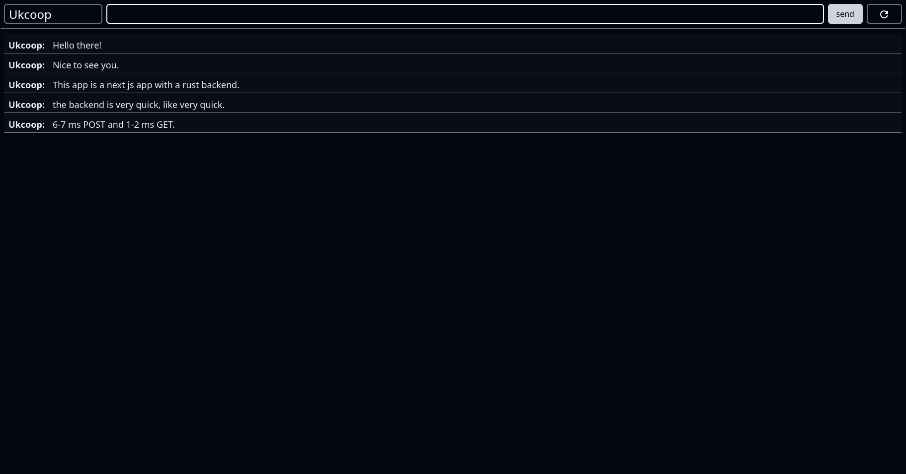

# next.js rust monprepo

This is a template for making a next js app with a rust backend that is fully deployed with docker compose.



---

# how to use

Once you have cloned the repo, you are going to want to run the following command.

```bash
npm install
```

You will need docker and docker compose installed, as well as nodejs and rust.

you can run a test deployment with the following command. 

```bash
npm run test-deployment
```

If you want to run it normally, run these commands individually.

```bash
npm run database
npm run backend
npm run frontend
```
